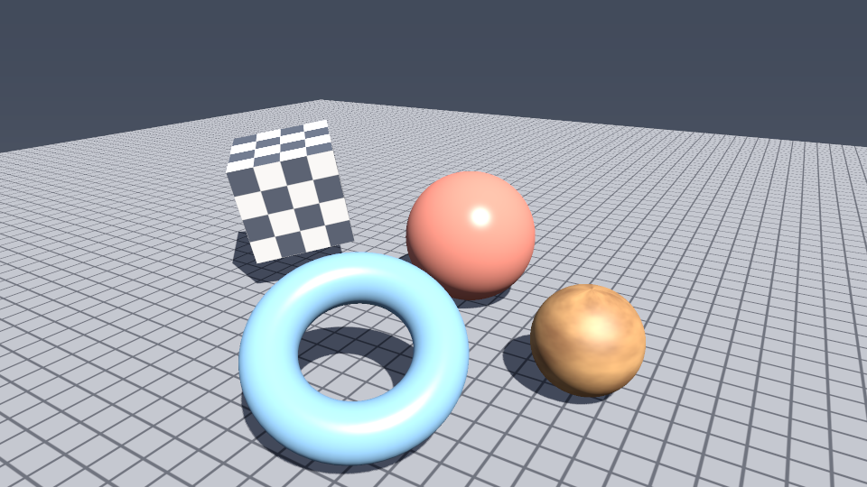
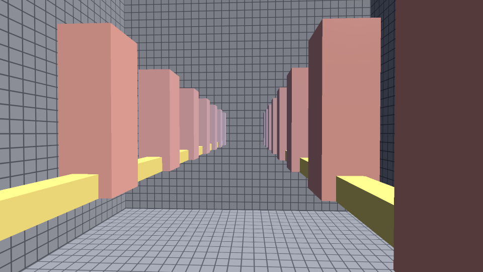
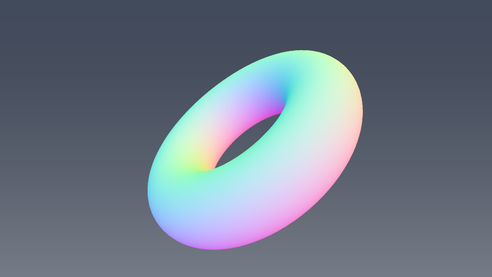
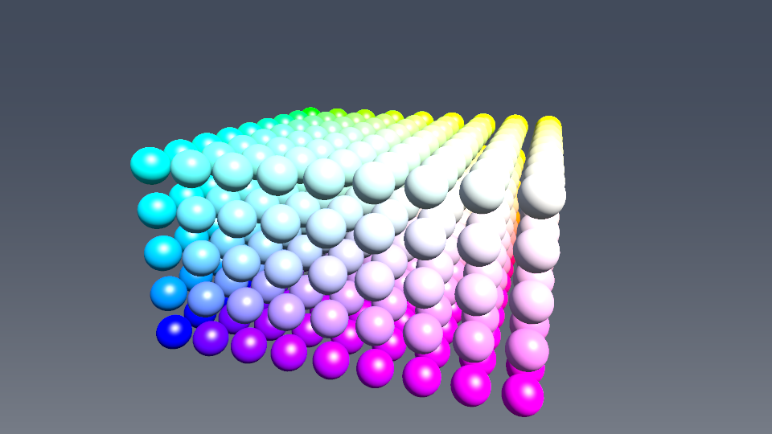

# Software Rasterizer

A 3D renderer that runs entirely on the CPU. Everything between a vertex buffer
and a pixel is written here: vertex transforms, frustum clipping, the
perspective divide, triangle scan conversion, depth buffering and shading. No
OpenGL, Vulkan or DirectX. The only dependency is the standard library, and that
includes the image output, so the PNG encoder and its DEFLATE compressor are in
`src/png.cpp` too.



960x540 with 2x supersampling. 12,302 triangles in 101 ms.

## Building

Needs CMake 3.20+ and a C++20 compiler.

```bash
cmake -B build -DCMAKE_BUILD_TYPE=Release && cmake --build build
```

```bash
./build/srdemo --scene showcase
```

Output lands in `out/`.

## Usage

```
srdemo [options]
  --scene <name>   showcase | normals | clipping | stress | model
  --obj <path>     OBJ file for --scene model
  --width  <n>     output width in pixels        (default 960)
  --height <n>     output height in pixels       (default 540)
  --ss <n>         supersampling factor, 1 = off (default 2)
  --threads <n>    worker threads, 0 = auto      (default 0)
  --frames <n>     render an n-frame turntable   (default 1)
  --out <dir>      output directory              (default out)
  --format <fmt>   png | bmp | ppm               (default png)
  --depth          write the depth buffer instead of shaded color
  --bench          run the threading benchmark and exit
```

Every render reports what the pipeline did:

```
  triangles  submitted 12302 | clipped 2 | culled 6482 | rejected 0 | rasterized 5566
  fragments  covered 1870654 | shaded 1870654 | written 1870654 (0.90x overdraw)
  time       101.4 ms (18.4 Mpix/s coverage)
```

Counts are for the camera pass. The time includes the shadow pass.

## How it works

A draw call runs three stages: geometry, binning, raster.

**Geometry** runs the vertex shader, then clips, culls and maps to pixels.

Clipping is Sutherland-Hodgman against seven half-spaces (`w > eps` plus the six
frustum planes), done in homogeneous clip space *before* the perspective divide.
That ordering is the point. Vertices behind the eye have `w <= 0`, and dividing
by that folds them back into view, so anything crossing the eye plane wraps
around the screen. Clipping can turn a triangle into a 9-gon, which then gets
fan-triangulated.

Back-face culling keys off the sign of the screen-space area. Front faces are
CCW in NDC, and the y flip in the viewport transform makes that negative.

**Binning** files each surviving triangle into every 64x64 tile it touches.

**Raster** scan-converts tiles. Coverage comes from three edge functions at each
pixel center, stepped along the scanline. Inside a covered pixel:

- Depth interpolates with plain screen-space barycentrics. Window z is affine in
  screen space, so that is exact.
- Varyings do not. They need `1/w` interpolated linearly and each vertex
  reweighted by its own. Interpolating attributes straight in screen space is the
  classic bug, and on a receding ground plane it is off by 3x at the midpoint.
  There is a test for it.
- The fill rule is top-left, so a pixel center exactly on a shared edge belongs
  to one triangle, never both or neither.

Shading happens in linear space. sRGB is applied once, on write.

## Threading

The raster stage is parallel over tiles, and one worker owns a tile, so no two
threads ever touch the same pixel. No atomics on the buffers, no locks in the
inner loop.

The tile grid does not depend on the thread count, and bin order is submission
order, so the output is bit-identical at any thread count. There is a test for
that rather than an assumption.

Workers live in a pool that outlives draw calls. That matters more than it
sounds: a scene of 35 small draws spawning threads per draw spent longer
creating threads than rasterizing, and scaled 1.25x on 16 cores. With the pool
it scales 4.2x.

## Shadows

No new machinery needed. Draw the scene again from the light with `colorWrite`
off and the depth buffer becomes a record of the nearest occluder in every
direction. Shading reprojects each point into that map and compares.

The bias is the interesting part. Compare a surface against a depth map it is
itself in and it shadows itself in stripes. Three things fix that: a constant
bias for quantization, a slope-scaled term that grows as the surface turns
edge-on, and a normal offset that moves the lookup off the surface first. All
three are in world units and divided by the light frustum's depth range at
sample time. In normalized depth they silently change meaning whenever the
frustum is resized, so a value tuned on one scene gives acne on the next. 3x3
PCF softens the edge.

The map covers a bounding sphere of the casters only. Receivers outside it count
as lit, which is how a 34-unit ground plane takes shadows from a 12-unit map.
Being depth-only it skips the color buffer, which at 2048 squared would be 50 MB
of nothing.

## Scenes

| | |
|---|---|
|  | `clipping` is a corridor built to work the clipper. The rails start behind the eye, cross the near plane, run the full width of the view and carry on past the far plane. |
|  | `normals` draws interpolated world-space normals. Quickest way to spot a winding or normal-matrix mistake. |
|  | `stress` is 405 spheres merged into one 317k-triangle draw call. Used by `--bench`. |

## Performance

16 cores, GCC 14.2 `-O3`, `stress` scene, best of three:

| Threads | 960x540 | speedup | 1920x1080 | speedup |
|--------:|--------:|--------:|----------:|--------:|
| 1  | 79.4 ms | 1.00x | 190.5 ms | 1.00x |
| 2  | 50.8 ms | 1.56x | 116.1 ms | 1.64x |
| 4  | 31.6 ms | 2.51x |  63.9 ms | 2.98x |
| 8  | 23.5 ms | 3.37x |  43.7 ms | 4.36x |
| 16 | 20.9 ms | 3.79x |  34.0 ms | 5.61x |

Same triangle count, better scaling at the higher resolution. That locates the
bottleneck: the work between the two parallel stages, merging the per-thread
geometry output and binning it, is still serial. More fragments means a bigger
parallel fraction. Parallelizing the bin build is the next thing to do.

## Tests

```bash
cmake --build build && ctest --test-dir build --output-on-failure
```

28 tests, aimed at the parts that are easy to get subtly wrong: matrix inverse
round-trips, the normal matrix under non-uniform scale, `perspective()` mapping
the frustum onto the clip cube, clipper output satisfying every plane, a
screen-filling quad covering every pixel exactly once, perspective-correct
interpolation against an analytic value, depth ordering, fragment discard, and
thread-count invariance.

The PNG tests walk the encoded stream and check every chunk length and CRC, the
zlib header, the deflate block type, and an independently recomputed Adler-32.
Nothing here can decode PNG, so acceptance by a real decoder was checked outside
the suite against Pillow, which reproduces the BMP path's pixels exactly.

## Layout

```
include/sr/
  math.hpp         Vec2/3/4, Mat4, projection, look-at, inverse, normal matrix
  camera.hpp       view/projection matrices, orbit helper
  mesh.hpp         indexed meshes, primitives, OBJ loading
  texture.hpp      nearest/bilinear sampling, procedural patterns
  framebuffer.hpp  color + depth target, sRGB encode, image output
  png.hpp          PNG encoder
  clip.hpp         clipping in homogeneous clip space
  pipeline.hpp     geometry, binning and raster stages
  shadow.hpp       shadow map fitting, bias, PCF
  shaders.hpp      Blinn-Phong, depth-only, normals, unlit
  thread_pool.hpp  workers shared across draw calls
src/               implementations and the demo driver
tests/             28 tests, plus a 40 line harness
```

Shaders are compile-time polymorphic. Any type satisfying the `ShaderProgram`
concept works: name a `VertexIn` and a `Varyings`, provide `vertex()` and
`fragment()`. The fragment function then inlines into the raster loop instead of
costing a virtual call per pixel. `Varyings` only has to be a vector space over
float, since clipping and interpolation are written against `operator*(float)`
and `operator+`, so a shader can carry whatever it wants across a triangle.

## Known limits

No mipmapping, so minified textures alias and `--ss` is the only antialiasing.
One shadow map, no cascades, so coverage trades against resolution. No blending
sort. The fragment shader is scalar rather than SIMD across a 2x2 quad. The
DEFLATE compressor uses fixed Huffman codes and greedy matching, so files come
out 25-40% larger than zlib's.
